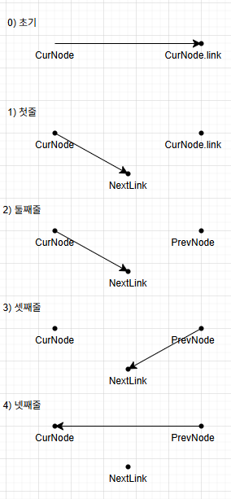
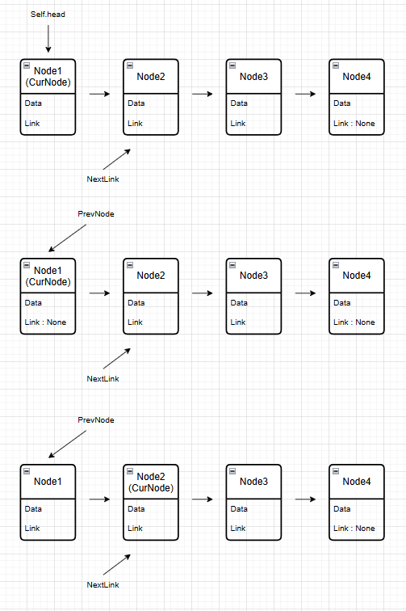

# 링크드 리스트


<details>
    <summary>결과물 미리보기</summary>
    
```python
class Node:
    def __init__(self, data, link=None):
        self.data = data
        self.link = link

class LinkedList:
    def __init__(self):
        self.head = None

    def append(self, data):
        if not self.head:
            self.head = Node(data)
            return
        current = self.head
        while current.link:
            current = current.link  # move current
        current.link = Node(data)

    def remove(self, target):
        current = self.head
        if self.head.data == target:
            self.head = self.head.link
            current.link = None
            return

        previous = None
        while current:
            if target == current.data:
                previous.link = current.link
                current.link = None
            previous = current
            current = current.link

    def search(self, target):
        current = self.head
        while current:  # bug fix
            if target == current.data:
                return f"{target}을(를) 찾았습니다!"
            else:
                current = current.link
        return  f"{target}은(는) 링크드 리스트 안에 존재하지 않습니다."

    def __str__(self):
        current = self.head
        result = ""
        while current is not None:
            result = result + f"{current.data} -> "
            current = current.link
        return result + "END"

    def reverse(self):
        PrevNode = None
        CurNode = self.head
        while CurNode:
            NextLink = CurNode.link 
            CurNode.link = PrevNode  
            PrevNode = CurNode  
            CurNode = NextLink 
        self.head = PrevNode

    def has_cycle(self):
        slow = self.head
        fast = self.head
        while fast.link and fast:
            slow = slow.link  
            fast = fast.link.link  
            if slow == fast:
                return True  
        return False 
```
부분부분 나눠서 이해해보자.
</details>


<details>
    <summary>클래스 노드, 클래스 링크드리스트</summary>
    
```python
class Node:
    def __init__(self, data, link=None):
        self.data = data
        self.link = link

class LinkedList:
    def __init__(self):
        self.head = None
```
노드는 데이터(data)와 다음 노드를 가리키는 링크(link)로 구성된다. data는 필수 입력값이며, link는 기본값으로 None을 가진다. 따라서 노드를 생성할 때 다음 노드를 지정하지 않으면 마지막 노드로 생성된다.

링크드 리스트는 생성될 때 self.head = None으로 초기화된다. 이는 첫 번째 노드를 아직 가리키고 있지 않은 빈(Empty) 링크드 리스트임을 의미한다. 이후 첫 번째 노드가 삽입되면 self.head는 그 노드를 가리키게 된다.

<details>
    <summary>AI의 한마디와 추가설명</summary>  <br>  

> **링크드 리스트의 시작점은 첫 번째 노드가 아니라 head이다.** <br>
head는 데이터를 저장하는 노드가 아니라 첫 번째 노드를 가리키는 참조 변수이다. 따라서 head가 None이라는 것은 데이터가 없는 것이 아니라, 리스트 자체가 비어 있음을 의미한다.

- Node 클래스는 하나의 노드를 표현하는 클래스이다.
- LinkedList 클래스는 여러 노드를 관리하는 클래스이다.
- 하나의 노드는 자신의 데이터와 다음 노드만 알고 있으며, 리스트 전체의 시작 위치는 head가 관리한다.
- link=None을 기본값으로 둔 이유는 새로운 노드를 만들 때 다음 노드가 없는 상태를 기본으로 하기 위해서이다.

여기서 가장 중요한 개념은 "Node와 LinkedList는 역할이 다르다"는 점이다.
- Node는 데이터를 담는 객체
- LinkedList는 노드들을 관리하는 객체
</details>
</details>


<details>
    <summary>링크드리스트 프린트문</summary>
    
```python
    def __str__(self):
        current = self.head
        result = ""
        while current is not None:
            result = result + f"{current.data} -> "
            current = current.link
        return result + "END"
```
자신의 헤드 노드를 current가 가리키도록 한다. 결과를 저장할 문자열 result는 빈 문자열("")로 초기화한다. current가 None이 될 때까지 반복하며, 현재 노드의 데이터를 문자열에 "데이터 -> " 형식으로 이어 붙인다. 이후 current = current.link를 수행하여 현재 노드가 가리키는 다음 노드로 이동한다. 이 과정을 반복하면 링크드 리스트의 모든 노드를 처음부터 끝까지 순회하게 된다. 반복문이 종료되면 마지막에 "END"를 덧붙여 리스트의 끝임을 나타낸 문자열을 반환한다.

<details>
    <summary>AI의 한마디</summary>
    <br>

> **링크드 리스트는 배열처럼 인덱스로 이동하지 않는다.** <br>
각 노드가 다음 노드의 주소(참조)를 가지고 있기 때문에, current = current.link를 반복하며 한 노드씩 순차적으로 이동한다. 이것이 링크드 리스트 순회의 기본 원리이다.

- self.head는 첫 번째 노드를 가리키는 시작점이다.
- current는 순회 과정에서만 사용하는 임시 참조 변수이므로, current를 이동시켜도 self.head는 변하지 않는다.
- current가 None이 되었다는 것은 더 이상 연결된 다음 노드가 없다는 뜻이며, 리스트의 끝에 도달했음을 의미한다.
- 마지막에 "END"를 붙이는 것은 사용자가 출력 결과만 보고도 리스트가 어디서 끝나는지 쉽게 확인할 수 있도록 하기 위한 표현이다.

> **성능 관점에서 볼만한 점** <br>
result = result + f"{current.data} -> "
는 문자열을 계속 새로 생성하기 때문에 노드가 많아질수록 비효율적일 수 있다. 교육용으로는 이해하기 쉽지만, 실제 파이썬에서는 문자열을 리스트에 모은 뒤 "".join(...)을 사용하는 방식이 더 효율적이다. 
</details>
</details>


<details>
    <summary>search() 메서드</summary>
    
```python
    def search(self, target):
        current = self.head
        while current: 
            if target == current.data:
                return f"{target}을(를) 찾았습니다!"
            else:
                current = current.link
        return  f"{target}은(는) 링크드 리스트 안에 존재하지 않습니다."
```
head부터 시작한 current가 존재하는 동안(current가 None이 아닐 동안), 현재 노드의 데이터(current.data)와 찾고자 하는 값(target)을 비교한다. 값이 일치하면 즉시 찾았다는 메시지를 반환하며 메서드를 종료한다. 일치하지 않으면 current = current.link를 수행하여 다음 노드로 이동한 뒤 같은 과정을 반복한다. 모든 노드를 순회할 때까지 원하는 값을 찾지 못하면 반복문이 종료되고, 링크드 리스트에 해당 값이 존재하지 않는다는 안내 메시지를 반환한다.
<details>
    <summary>AI의 한마디와 추가설명</summary>  <br>  
    
> **링크드 리스트는 원하는 데이터를 찾기 위해 처음부터 차례대로 확인해야 한다.** <br>
> 배열처럼 인덱스로 바로 접근할 수 없기 때문에, 특정 데이터를 찾는 과정은 최악의 경우 마지막 노드까지 모두 확인해야 한다.

- current는 항상 현재 검사 중인 노드를 가리키는 참조 변수이다.
- 원하는 데이터를 찾는 즉시 return이 실행되므로, 이후의 노드는 더 이상 검사하지 않는다.
- while current:는 while current is not None:과 같은 의미로 사용할 수 있는 파이썬의 축약 표현이다.
- 이 메서드의 시간복잡도는 O(n) 이다. 찾는 데이터가 마지막에 있거나 존재하지 않는 경우 모든 노드를 순회해야 하기 때문이다.
- 배열은 인덱스를 이용한 직접 접근(Random Access)이 가능하지만, 링크드 리스트는 노드를 하나씩 따라가야 하는 순차 접근(Sequential Access)만 가능하다.
</details>
</details>


<details>
    <summary>append() 메서드</summary>
    
```python
    def append(self, data):
        if not self.head:
            self.head = Node(data)
            return
        current = self.head
        while current.link:
            current = current.link  
        current.link = Node(data)
```
append() 메서드는 새로운 노드를 링크드 리스트의 마지막에 추가하는 기능을 수행한다. 먼저 self.head가 존재하지 않으면, 현재 리스트가 비어 있는 상태이므로 새 노드를 생성하여 head가 가리키도록 한 뒤 메서드를 종료한다. head가 이미 존재하면 current를 head로 초기화한 후, current.link가 존재하는 동안 current = current.link를 반복하여 마지막 노드까지 이동한다. 마지막 노드에 도달하면 current.link = Node(data)를 수행하여 새 노드를 연결한다.
<details>
    <summary>AI의 한마디와 추가설명</summary>  <br>  
    
> **링크드 리스트는 마지막 노드를 바로 알 수 없기 때문에, 새로운 노드를 추가하려면 끝까지 순회해야 한다.** <br>
> 따라서 단순한 append() 연산도 마지막 노드를 기억하지 않는 구현에서는 O(n)의 시간이 걸린다.

- if not self.head:는 빈 링크드 리스트인지 확인하는 조건이다.
- return을 사용하는 이유는 첫 번째 노드를 추가한 뒤 더 이상 아래 코드를 실행할 필요가 없기 때문이다.
- while current.link:는 다음 노드가 존재하는 동안만 이동한다. 반복문이 종료되면 current는 마지막 노드를 가리키고 있다.
- 마지막 노드의 link는 None이므로, 여기에 새 노드를 연결하면 리스트의 끝에 새로운 노드가 추가된다.
- 현재 구현의 시간복잡도는 O(n) 이다. 마지막 노드까지 순회해야 하기 때문이다. 만약 링크드 리스트가 마지막 노드를 가리키는 tail 포인터를 함께 관리한다면 append()를 O(1) 에 수행할 수도 있다
</details>
</details>


<details>
    <summary>remove() 메서드</summary>
    
```python
    def remove(self, target):
        current = self.head
        if self.head.data == target:
            self.head = self.head.link
            current.link = None
            return

        previous = None
        while current:
            if target == current.data:
                previous.link = current.link
                current.link = None
            previous = current
            current = current.link
```
먼저 삭제하려는 데이터가 head에 있는지 확인한다. 만약 첫 번째 노드가 삭제 대상이라면 self.head를 기존 head의 다음 노드(self.head.link)로 옮긴다. 이후 기존 첫 번째 노드의 link를 None으로 변경하여 연결을 끊고 메서드를 종료한다.

첫 번째 노드가 삭제 대상이 아니라면 previous와 current를 이용하여 리스트를 순회한다. previous는 항상 현재 노드의 이전 노드를 가리키고, current는 검사 중인 노드를 가리킨다. 삭제할 데이터를 찾으면 previous.link = current.link를 수행하여 이전 노드가 현재 노드를 건너뛰고 다음 노드를 가리키도록 연결을 변경한다. 이후 current.link = None으로 현재 노드의 연결을 끊어 링크드 리스트에서 완전히 분리한다.
<details>
    <summary>AI의 한마디와 추가설명</summary>  <br>  
    
> **링크드 리스트에서 노드를 삭제하는 핵심은 노드를 지우는 것이 아니라 연결(Link)을 변경하는 것이다.** <br>
> 이전 노드가 삭제할 노드의 다음 노드를 가리키도록 연결을 바꾸면, 삭제할 노드는 더 이상 리스트에 포함되지 않는다.

- previous가 필요한 이유는 단일 링크드 리스트에서는 현재 노드에서 이전 노드로 이동할 수 없기 때문이다.
- 삭제 대상이 첫 번째 노드인 경우에는 이전 노드가 존재하지 않으므로 별도로 처리해야 한다.
- current.link = None은 삭제된 노드가 더 이상 다른 노드를 참조하지 않도록 연결을 끊는 과정이다.
- 파이썬에서는 삭제된 노드를 참조하는 변수가 더 이상 없으면, 가비지 컬렉터(Garbage Collector)가 적절한 시점에 메모리를 회수한다.

> **AI가 추천하는 코드 변경** <br>
> 삭제가 성공하면 그 순간 끝내는 것이 가장 읽기 쉽다.

```py
if target == current.data:
    previous.link = current.link
    current.link = None
    return
```
기존 코드 역시, 흥미롭게도, 대부분의 경우 원하는 삭제는 성공한다. 그런데 왜 좋지 않은 코드인가? <br>
이유 1 : 삭제가 끝났는데 계속 아래 코드를 실행한다. 즉 삭제 -> previous 갱신-> current 갱신을 괜히 한다. 삭제가 성공했으면 이미 할 일이 끝난 것이다. <br>
이유 2 : 코드의 의도가 흐려진다. 사람이 읽으면 '삭제 후에도 계속 순회하나?' 라는 생각을 한다. 하지만 실제로는 current.link = None 때문에 우연히 종료된다. 즉 의도적으로 종료하는 것이 아니라 우연히 종료되는 구조가 된다. <br>
이유 3 : 유지보수성이 떨어진다. 나중에 누군가 current.link = None을 지워 버리면 삭제 후에도 계속 순회하게 된다. 그러면 중복 데이터 삭제처럼 동작이 바뀔 수도 있다. <br>
그래서 이 코드는 알고리즘 자체는 맞게 설계되어 있지만, 종료를 명시적으로 하지 않고 우연한 상태 변화(current.link = None)에 의존하는 점이 아십다. 교육용 리포지토리라면 오히려 이런 부분을 "개선 포인트"로 짚어 주는 것도 좋은 학습 자료가 될 수 있다.
</details>
</details>


<details>
    <summary>링크드 리스트 뒤집기 (개인적으로 어려웠던 구간)</summary>
    
```python
def reverse(self):
    PrevNode = None
    CurNode = self.head
    while CurNode:
        NextLink = CurNode.link 
        CurNode.link = PrevNode  
        PrevNode = CurNode  
        CurNode = NextLink 
    self.head = PrevNode
```
어려운 이유 : 링크드 리스트 뒤집기는 노드를 이동시키는 것이 아니라 링크의 방향을 바꾸는 알고리즘이다. 가장 어려운 점은 링크의 방향을 바꾸는 순간 기존의 다음 노드 정보를 잃어버릴 수 있다는 것이다. 따라서 기존 링크를 먼저 백업한 뒤 방향을 반대로 바꾸고, 다음 노드로 이동하는 순서가 매우 중요하다.<br><br>

개론 : link의 대입이란 목적지까지의 끝으로 향하는 화살표의 종점을 유지하며 화살표의 시점을 대입하는 방향으로 덮어쓰는 과정이다. 따라서 NextLink=CurNode.link는 기존의 현재 노드가 가리키는 종점 정보를 유지한 상태에서 새로운 변수에 시점을 임시저장하는 형태로, 추후 지금의 CurNode에 대해 CurNode.link.link = NextLink 가 CurNode의 이동 등과 연관지어져서 이루어짐을 암시한다. 그런 코드가 실제로 있다는 뜻이 아니라, CurNode.link=Curnode가 PrevNode를 걸쳐 작동하는 것이 CurNode = NextLink랑 맞물려 작동한다는 뜻이다. <br><br>

4줄의 의미 : 
```py
NextLink = CurNode.link #아직 방문하지 않은 다음 노드를 백업
CurNode.link = PrevNode #현재 노드의 링크 방향을 반대로 바꿈
PrevNode = CurNode #뒤집기가 완료된 리스트를 한 칸 확장함
CurNode = NextLink #백업해 둔 다음 노드로 이동
```
```py
NextLink = CurNode.link #화살표의 종점을 백업
CurNode.link = PrevNode #순서를 뒤집은 후의 링크드리스트 전체의 시점을 지정
PrevNode = CurNode #화살표의 시점을 이동
CurNode = NextLink #화살표의 종점을 재이동해 화살표 뒤집기 완료
```

4개 코드 문장의 순서 설명 : 이처럼 CurNode.link를 다른 변수에 임시저장한 상태에서, 그 위를 PrevNode로 덮어쓰게 되면 이는 CurNode의 link 방향이 정반대로 바뀐 것이다. 그렇다면 기존의 CurNode.link가 가리키는 오브젝트(종점)의 정보에는 어떻게 접근 할 수 있을까? 그렇다. NextLink=CurNode.link로 백업을 이미 해놓았지 않은가. 이러한 과정을 그 다음, 그 다다음의 노드에서도 계속하기 위해선 기존의 CurNode.link에 해당하는 NextLink를 CurNode에 덮어쓰면 된다, 그리고 당연히 그 사이엔 PrevNode를 CurNode로 끌어오는 과정이 순서에 맞게 들어가야 한다. 다시 말해, NextLink=CurNode.link; 와 CurNode=NextLink; 사이에는 현재 노드가 화살표의 방향을 반대로 돌리는 CurNode.link=PrevNode; 와 그러한 PrevNode를 PrevNode=CurNode;로 끌어오는 과정이 필연적으로 필요하며, 예를 들어가며 작동시켜보면 잘 작동된다는 것을 알 수 있게 된다. 이러한 과정이 끝난 후에 새로운 head를 알맞게 지정하면 끝이다. <br><br>

4개 코드 문장의 AI 설명 : link에 값을 대입한다는 것은 화살표의 시작점이 가리키는 대상을 변경하는 것이다. 따라서 CurNode.link = PrevNode를 먼저 수행하면 기존에 CurNode.link가 가리키던 다음 노드의 정보는 사라진다. 이를 방지하기 위해 먼저 NextLink = CurNode.link로 기존의 연결을 백업한다. 이후 CurNode.link = PrevNode를 수행하여 현재 노드의 화살표를 반대로 돌린다. 마지막으로 PrevNode = CurNode, CurNode = NextLink를 수행하여 한 칸 앞으로 이동하면, 같은 작업을 다음 노드에서도 반복할 수 있다. <br><br>

이미지자료 : 
 <br><br>

변수역할 : NextLink는 아직 처리하지 않은 나머지 리스트를 잃지 않기 위한 백업을, PrevNode는 지금까지 뒤집기가 완료된 리스트의 새로운 head를 수행한다. <br> NextLink는 아직 방문하지 않은 다음 노드를 기억하고, PrevNode는 이미 뒤집기가 완료된 리스트를 가리킨다. CurNode는 이 둘을 연결하는 현재 작업 대상이다. <br> NextLink는 미래를 잃지 않기 위한 변수이고, PrevNode는 과거를 쌓아 가는 변수이다. <br><br>

알고리즘의 진행 (1) : CurNode.link가 PrevNode로 대체되면 현재 노드의 링크 방향은 반대로 바뀌지만, 알고리즘은 멈추지 않는다. 그 이유는 링크를 뒤집기 전에 NextLink = CurNode.link를 통해 아직 처리하지 않은 다음 노드의 참조를 미리 백업해 두었기 때문이다. 따라서 CurNode.link = PrevNode로 현재 노드를 이미 뒤집어진 리스트의 맨 앞에 연결한 뒤, PrevNode = CurNode를 수행하여 뒤집기가 완료된 리스트를 한 노드 확장하고, 마지막으로 CurNode = NextLink를 수행하여 백업해 두었던 다음 노드로 이동한다. 이 과정을 반복할 때마다 PrevNode 앞에는 새로운 노드가 하나씩 이어 붙여지고, CurNode는 아직 뒤집지 않은 나머지 리스트를 계속 순회하게 된다. 결국 반복문이 종료되면 PrevNode는 완전히 뒤집어진 링크드 리스트의 새로운 head를 가리키게 된다.<br>
매 반복바다 역할은 이렇게 바뀐다.<br>
1.CurNode는 현재 작업할 노드를 가리킨다.<br>
2.NextLink는 그 다음 노드를 백업한다.<br>
3.CurNode.link를 PrevNode로 바꾼다.<br>
4.PrevNode를 현재 노드로 이동시킨다.<br>
5.CurNode를 백업해 둔 NextLink로 이동시킨다<br><br>

알고리즘의 진행 (2) : Reverse 알고리즘에서는 객체는 한 번도 이동하지 않는다. 이동하는 것은 CurNode, PrevNode, NextLink와 같은 포인터이며, CurNode.link = PrevNode는 노드 내부 화살표의 종점을 바꾸는 연산이고, CurNode = NextLink는 현재 작업 포인터의 시점을 다음 객체로 옮기는 연산이다.

 <br><br>

</details>


<details>
    <summary>링크드 리스트 사이클 찾기</summary>
    
```python
def has_cycle(self):
    slow = self.head
    fast = self.head
    while fast and fast.link:
        slow = slow.link  
        fast = fast.link.link  
        if slow == fast:
            return True  
    return False 
```
이 메서드의 정확도를 고등학교까지의 수학적으로 따져볼 필요성이 있어보인다. slow와 fast의 이동 칸 수 차이가 1임으로 사이클의 끝에 None 대신 사이클의 원소가 들어있지 않은지를 판별할 수 있다는 명제의 참거짓을 밝히기 위해, 사이클의 끝에 사이클의 원소 잘못 대입을 가정한 후 slow와 fast의 칸 수 차이가 2 이상이지 못함을 보이자. 이 때 칸수가 2일때만 보이면 충분하며, 예시로 1-2-3-4-2 와 1-2-3-4-5-2 의 두 가지 예시가 모두 만족함으로 전제하는 근본 논리가 참임을 보일 수 있다. 

<details>
    <summary>AI의 한마디와 추가설명</summary>  <br>  

slow 포인터는 한 번에 1칸, fast 포인터는 한 번에 2칸 이동하므로 두 포인터의 상대적인 거리는 반복마다 1칸씩 증가한다. 두 포인터가 모두 사이클 내부에 들어온 이후에는 이 상대적인 거리가 사이클의 길이를 법(modulo)으로 하는 순환을 반복한다. 따라서 유한한 길이의 사이클에서는 상대적인 거리가 반드시 0이 되는 순간이 존재하며, 그 순간 두 포인터는 같은 노드를 가리키게 된다. 반대로 사이클이 없다면 fast 또는 fast.link가 None이 되어 반복문이 종료되므로 False를 반환한다.

앞에서 두 포인터의 상대적인 거리가 반복마다 1씩 증가한다고 설명하였다. 이를 수식으로 표현하면 
```
(상대적 거리) = n (단, n은 while문의 반복 횟수)
```
하지만 링크드 리스트의 사이클은 끝이 없는 직선이 아니라 다시 처음으로 이어지는 원형 구조이다. 따라서 사이클의 길이를 L이라 할 때, 상대적인 거리는 단순히 계속 증가하는 것이 아니라 사이클의 길이를 기준으로 순환하게 된다. 이를 수식으로 나타내면
```
(상대적 거리) = n mod L (단, n은 while문의 반복 횟수)
```
이 된다. 여기서 mod는 사이클의 길이를 기준으로 위치를 순환시키는 연산을 의미한다. 사이클의 길이는 유한하므로, 상대적인 거리는 증가하다가 다시 처음 위치로 돌아오게 된다. 결국 어느 순간 
```
n mod L = 0
```
을 만족하는 n이 반드시 존재하며, 이는 두 포인터의 상대적인 거리가 0이 되어 같은 노드를 가리킨다는 의미이다. 따라서 사이클이 존재하면 slow와 fast는 반드시 만나게 된다.

> 위 증명에서 사용된 mod 연산은 처음 등장하는 개념이다.
왜 이러한 식이 성립하는지, 그리고 mod가 무엇을 의미하는지는 다음 문서인 모듈러(Modular) 연산에서 자세히 설명한다.
</details>
</details>

